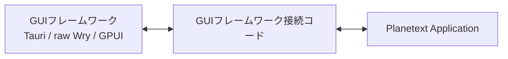
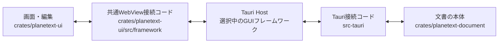
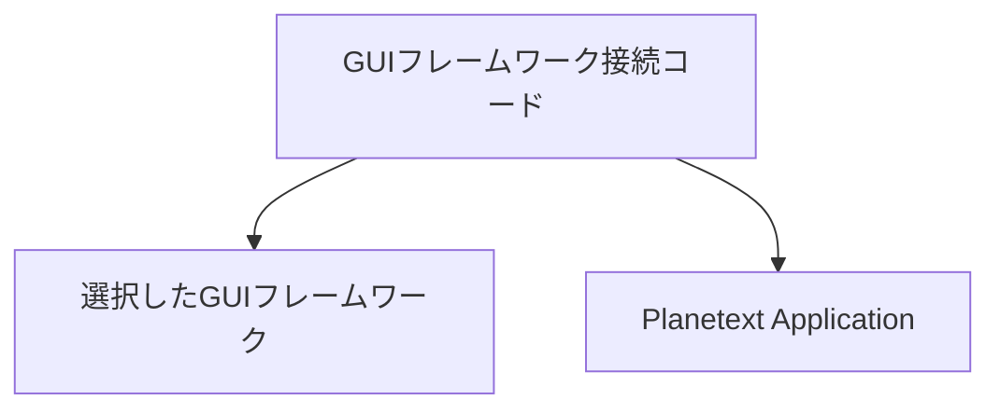
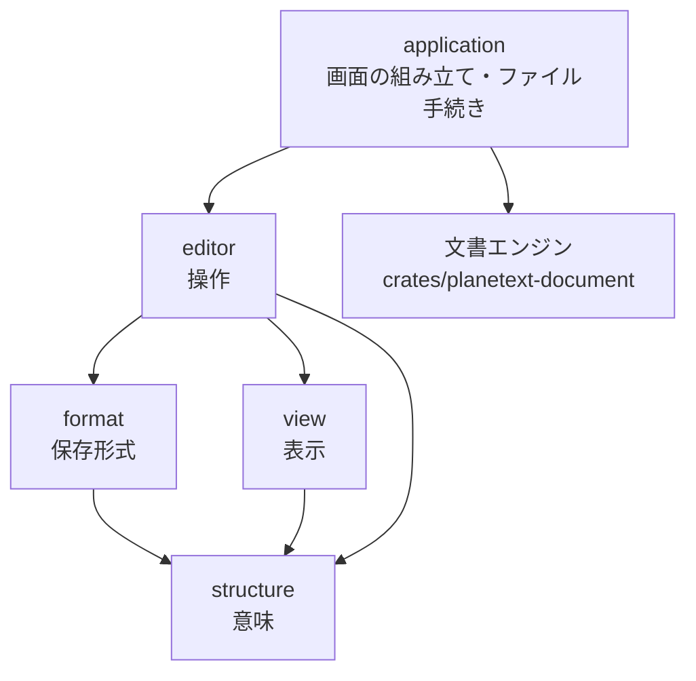
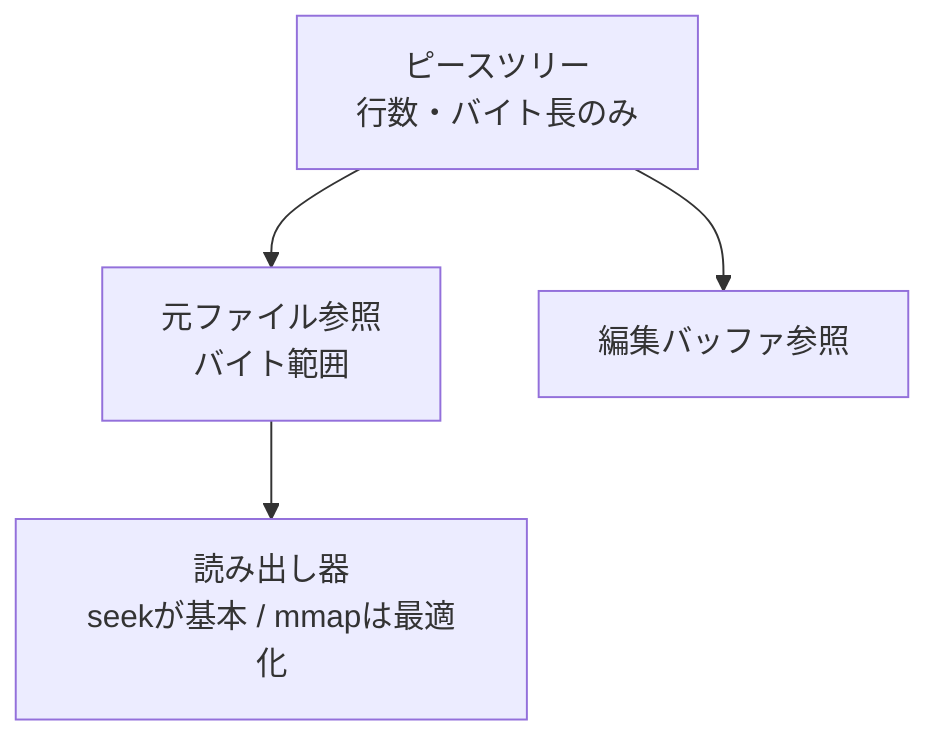
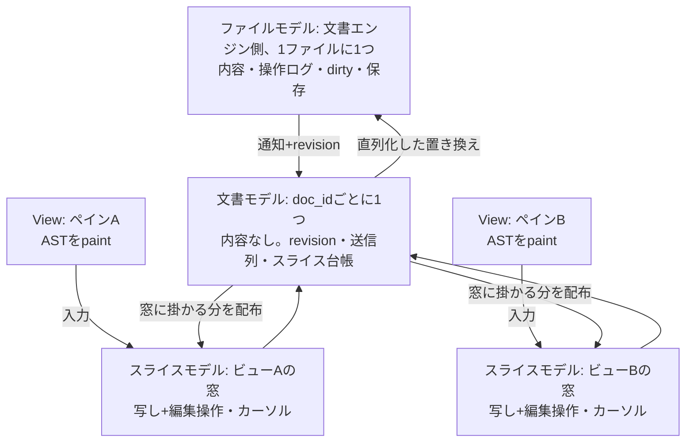
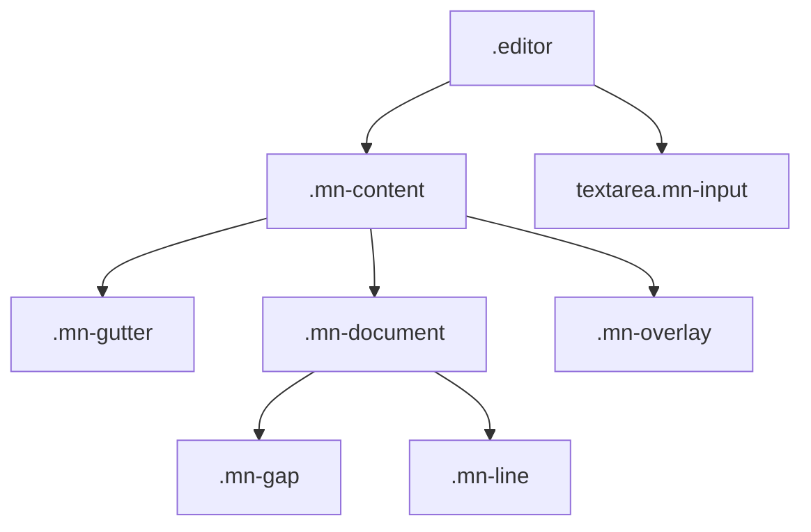

# 目標

Planetext の目標は**「次のプレーンテキスト」を定義すること**。すべての設計判断は
この大前提から導く。

- それを扱えるエディタが他のエディタと比べて遜色ないこと。ただのテキストエディタ
  として考えても Zed や helix より使われるエディタにする。パフォーマンスで妥協しない。
- 他に広げることが容易であること。Web への表示が簡単であること、出力形式に
  とらわれないこと、旧来のプレーンテキストとしても読めること。
- 構造を扱うときもテキストエディタと変わらない感覚で使えること。
- 多言語対応を行い、日本だけでなく英語が母国語でない国でも使われるようにする。
  IME のない英語圏でも「sqrt + Space」のような入力で √ や √構造へ変換できることを目指す。

# 層の分け方

## 最上位原則: フレームワークとアプリケーションを分離する

Planetext のアプリケーションは、Tauri、raw Wry、GPUI など、特定のデスクトップ
フレームワークに所属させない。選択したフレームワークとの間に薄い接続コードを置き、
接続コードだけがフレームワークとアプリケーションの両方を知る。



実際のディレクトリとの対応は次の通りとする。現在選択している GUI フレームワークは
Tauri であり、Wry や GPUI はこの位置に入る代替実装である。WebView側の接続コードは
特定のフレームワークを知らず、選択したHostが共通のHost bridgeを提供する。



| 場所 | 図の役割 |
| --- | --- |
| `crates/planetext-ui/` | Planetext Application の画面・編集(WebView側) |
| `crates/planetext-ui/src/framework/` | GUIフレームワーク接続コード(WebView側) |
| `src-tauri/` | GUIフレームワーク接続コード(OS側)と起動処理 |
| `crates/planetext-document/` | 文書の本体。保存・検索・下書き・設定を扱う |
| `src-tauri/src/platform.rs` | OS clipboard の platform adapter |

### Host差し替えの完了条件

`src-tauri` を `src-wry` または `src-gpui` に差し替えても、次の 2 つの crate に
コード変更を加えずに動くことを Phase 1 の完了条件とする。

- `crates/planetext-ui` は Tauri、Wry、GPUI の API・型・名前を知らない。
- `crates/planetext-document` は GUI フレームワークを知らない。
- WebView側は共通の Host bridge(`window.__PLANETEXT_HOST__`)だけを呼び、各 Host が
  その bridge を実装する。bridge は command の実行とイベント購読だけを提供する。
- Tauri固有のIPC、起動、window、menu、tray、dialog、shortcut、Host設定は
  `src-tauri` の中だけに置く。`src-wry` / `src-gpui` は同じ bridge 契約を実装する。
- DOM操作は `crates/planetext-ui` に残してよい。DOM操作とTauri IPCを同一視しない。
- Tauri専用の `.taurignore` は Tauri Host のディレクトリに置き、他の Host に
  影響を与えない。

依存関係は次の通りとする。



- アプリケーションは Tauri、Wry、GPUI の型・ライフサイクル・command 名を知らない。
- 各フレームワークは Planetext の文書、編集、検索、保存などの内部構造を知らない。
- 接続コードはフレームワークのイベントとアプリケーションの入口を相互変換するだけにする。
- 接続コードにエディタ機能、文書状態、検索、保存判断、表示判断を置かない。
- フレームワークを切り替えても、アプリケーションの機能と動作を変更しない。
- フレームワーク固有機能は接続境界の外へ漏らさず、利用できないHostでは代替または
  unsupportedとして扱う。アプリケーション本体に条件分岐を散らさない。

### GUIフレームワークAPI

抽象化するのは、アプリケーションからOS UIを呼び出す少数の機能だけとする。
文書操作、検索、保存処理、編集処理をGUIフレームワークAPIへ含めない。

```rust
trait GuiFramework {
    async fn pick_open_file(&self) -> Result<Option<PathBuf>, GuiError>;
    async fn pick_save_file(&self, default_name: &str) -> Result<Option<PathBuf>, GuiError>;
    async fn confirm(&self, request: ConfirmRequest) -> Result<bool, GuiError>;

    fn set_menu(&self, menu: MenuModel) -> Result<(), GuiError>;
    fn update_menu(&self, state: MenuState) -> Result<(), GuiError>;
    fn set_tray(&self, tray: TrayModel) -> Result<(), GuiError>;
    fn register_global_shortcut(&self, shortcut: Shortcut) -> Result<(), GuiError>;

    fn show_window(&self) -> Result<(), GuiError>;
    fn hide_window(&self) -> Result<(), GuiError>;
    fn focus_window(&self) -> Result<(), GuiError>;
    fn open_external(&self, target: &str) -> Result<(), GuiError>;
}
```

これは概念上のAPIであり、Rustのtrait構文やasyncの実装方法は詳細設計時に確定する。
機能を増やす場合も、OS UIまたはウィンドウ管理に該当するかを確認する。

フレームワークからアプリケーションへ届く通知も少数の共通イベントへ変換する。

```rust
enum GuiEvent {
    MenuSelected(MenuId),
    CloseRequested,
    TraySelected(TrayAction),
    GlobalShortcut(ShortcutId),
    SecondInstance,
}
```

- Tauri接続コードはTauri APIをこのAPIとイベントへ変換する。
- GPUI接続コードはGPUI APIを同じAPIとイベントへ変換する。
- raw Wryを使う場合も同じAPIを実装する。
- アプリケーションはどの実装が選択されているかを知らない。

設定ディレクトリ、文書ファイルI/O、Document Store、検索job、clipboard等は、必要なら
別の責務として扱う。OS上で動くという理由だけで`GuiFramework`へ入れない。

### WebView の位置付け

WebView への依存はアプリケーション内にあってよい。Planetext はデスクトップ専用の
閉じたエディタではなく、「次のプレーンテキスト」としてWeb等へ移植できることを
重要な要件とする。

- WebView / Leptos 表示は、正式なアプリケーション実装として維持する。
- Tauriからraw Wryへ変更しても、同じWebViewアプリケーションを利用できるようにする。
- GPUIとWryを組み合わせる場合も、WebView側の機能を失わない。
- 将来、性能上の理由でGPUI等による独自表示コンポーネントを実装してもよい。
- 独自表示コンポーネントを追加する場合も、WebView実装を廃止したり機能を劣化させたり
  せず、同じアプリケーション機能との互換性を維持する。
- WebView版と独自表示版は、同じアプリケーション機能との互換性を維持する。

---

**文書の本体はGUIフレームワーク接続コードではなく、文書エンジン(`crates/planetext-document`)にある。**
本体(ファイルモデル)は内容・操作ログ・保存・走査を持つ。webview 側が持つのは
見えている窓の写し(スライス)で、行は見えた場所から取り寄せられ、まだ届いて
いない行は空に見える(`docs/large-files.md`)。編集は手元のスライスへ同期的に
適用され、文書モデルが直列化して「行範囲の置き換え」として本体へ届く。整合は
revision で取る(「MVC」の節を参照)。

webview 側で扱う文書は `Text`（行の列）で、各行は `Row = Vec<Node>` として見える。
素のテキストだけの行は内部では文字列のまま持ち、`Row` として見られたときに展開する。
普通の文字、文書レベルの列区切り、分数・ルート・行列などの二次元構造は、同じ行の
兄弟 `Node` として並ぶ。構造だけを囲む島や数式モードはモデルにもエディターにもない。
文書の改行は `Text.lines` だけが持ち、構造内部の `Row` は改行を持たない。

そのため、**「意味」「書き方（保存形式）」「見せ方（表示）」の 3 つを混ぜない**
ことが設計上いちばん大事になる。混ざると、保存形式を直すと表示が崩れ、表示を
直すとファイルが変わる、という状態になり、どちらも直せなくなる。



各層が何であって、何に依存してはいけないか。中身（どのファイルが何をするか）は
各モジュールの冒頭のコメントにある。

| 層 | 何であるか | 依存してよいもの |
| --- | --- | --- |
| `structure` | 文書の意味。`Node` の行、構造のスロットと絶対パス、その編集 | なし（記法も DOM も出てこない） |
| `format` | ファイルの読み書き。記法を知る唯一の層 | `structure` |
| `view` | 意味を画面に描き、描いたものを測る | `structure` |
| `editor` | 操作。カーソル・選択・入力・IME・検索・クリップボード | 上のすべて |
| application (`crates/planetext-ui`) | 画面の組み立て、タブとペイン、ファイル手続き、本体との同期 | `editor`、文書エンジン |
| 文書エンジン (`crates/planetext-document`) | 文書の本体、行・履歴・保存・走査 | GUIフレームワークを知らない |
| GUIフレームワーク接続コード | WebViewまたはOSのGUIとApplicationの相互変換 | 選択したGUIフレームワーク、Applicationの公開API |

文書エンジンは記法の意味を知らない。`$` が特別なのは format 層だけの知識で、
本体の走査は「この文字を含む行は読み替えが要る」と教わって印を返すだけ、
記法を含む行の検索や読み下しは webview 側が行う。

守っている約束は 3 つだけ。

- **`format` はファイル以外に使わない。** クリップボードはファイルではないので、
  コピー・ペーストがここを通ってはいけない（通っていたために、分数をコピーする
  と記法の文字列が貼られていた）。外に出るのは `structure::plain` が読み下した
  普通のテキスト。
- **行はどこにあっても行。** 本文の行も分数の分子も `view::row` が描く。
  文字はどの深さでも `NodeKind::Char` で、連続する `mn-run` として同じように描く。View は数・識別子・演算子などの意味を推測しない。最上位だけが `NodeKind::Tab` を列揃えとして扱い、入れ子の行は Tab に意味を与えない。
- **置くことと測ることは分ける。** 比例フォントでは browser が組んだ後でしか
  位置が分からないので両方向必要で、混ざるとカーソルがずれたときに「置き方が
  悪いのか測り方が悪いのか」を切り分けられない。

## この分離を壊さないための仕掛け

`crates/planetext-ui/tests/layering.rs` がソースを読んで、次を機械的に落とす。

- `structure` が `view` / `editor` / DOM に触れている
- `format` が `view` / `editor` / DOM に触れている
- `view` が `format` に触れている
- `structure` / `view` / `editor` の製品コードが `$( … )` を書いている
- `format::document` がファイル 1 つ分の読み書き以外を外に出している

例外は 1 つだけで、`structure` の**テストのフィクスチャ**は記法で書いてよい
（構造をベタ書きするより読みやすいため）。製品コードでは禁止。

## 文書ストア(文書エンジンの最下層)

本文はメモリに置かず、**seek による部分読みを基盤とする**。走査完了前でも EOF から
tail を読めることを常に保証する。mmap は同じ読み出し界面の内部的な最適化オプション
であり、前提にしない(mmap が使えなくても全機能が動く)。

文書の形は**ピースツリー**とする。各ノードは部分木の改行数とバイト長を持ち、葉は
「元ファイルのバイト範囲」か「操作ログが所有する編集実体」を参照する。中身は必要時に
読み出す(遅延読込)。行位置の解決と編集を O(log ピース数) にする。ピース自身に絶対
行番号を持たせない。

文書エンジン内部のモジュール責務と、Phase 4 以降の Document Model・Slice Model・View
からの利用関係は [文書エンジンのモジュール境界](document-engine-modules.md) に定める。



### 規模を意識させない(100GB オーダー)

ファイルの大きさはストア内部だけの事情とし、外へ漏らさない。

- ビュー/スライスは小さなファイルも 100GB オーダーも同じ界面(スライス取り寄せ・
  編集・検索)で扱う。索引の有無や閾値はストア内部の判断とする。
- **ファイル実体をメモリへ乗せる操作を一切設けない**。開く・検索・正規表現・置換・
  保存はすべて逐次読みと部分読みで行う。全文を返す API をストアに作らない。
- 検索・正規表現は重なり付きのブロック走査で流し、結果は逐次返す。
- **置換の結果は書かない**。「すべて置換」はログに操作(パターン・置換文字列・
  範囲)だけを記録し、表示・検索は読んだ窓/ブロックへその場で適用する。
  実体化は正式保存のストリーム書き 1 回だけ。
- 操作から導出できない実体(ペースト等の外部由来テキスト)だけがログに入り、
  メモリ予算を超えた分は下書きファイルへ流して参照へ置き換える。
- Undo で必要な削除実体は、元ファイル由来なら可能な限り元ファイルへの参照とし、
  それ以外は操作ログが所有する実体領域に置く。挿入用と削除用の領域を分けてもよいが、
  操作ログから独立した履歴や別の真実にはしない。
- 1 行が異常に長いファイル(閾値超え)は異常データとして開くことを拒否する。
- 巨大範囲のコピーは実体を組み立てない。「この文書の revision R の行 a..b」と
  いう参照を内部クリップボードへ置き、ペースト時に参照からストリームで挿入する。
  参照先の内容は操作ログで再構成できる(ログの保持期間内に限る)。閾値を超える
  コピーは OS クリップボードへ実体を出さず、外部アプリへのペーストは対象外とする。

### 操作ログ(revision)

編集は revision 番号付きの追記専用ログとして記録し、基本はメモリに持つ。ログが
記録するのは**操作**であり、操作から導出できる結果は記録しない。**ログが単一の
真実であり、Undo・下書き・検索インデックスの差分・スライス整合はすべてこのログ
1 本から導出する。**

- Undo / Redo はこのログから導出する。Undo で戻った位置より先の Redo 枝は、
  新しい編集が入った時点で切り捨てる。
- dirty は「保存時の revision」と現在の revision の比較で判定する。
- revision R 時点で計算した結果(検索ヒット、索引、行数)は、ログ R..現在 を
  適用して現在座標へ写像する。編集範囲に掛かった結果は無効化する。
- 検索などの長い処理は文書をロックせずスナップショットで走り、結果を写像して
  返す。返る結果は常に現在の文書と整合する。
- 操作は**基準 revision**(その操作が書かれた時点の revision)を持つ。
  ファイルモデルは単一の直列化点であり、基準が古い操作はログで現在座標へ
  変換してから適用する。これは将来、ファイルモデルへローカル以外の編集元
  (他ユーザー)が届く複数ユーザー編集の土台であり、そのための新しい部品を
  今は作らないが、この形から外れない。

### 下書き = 元ファイル参照 + 操作ログ + 育てた索引

- ユーザー操作が落ち着いた(idle)タイミングで、操作ログを下書きファイルとして
  書き出す。メモリ予算を超えた実体は idle を待たずに書き出す。
- 下書きは「不変な元ファイルへの参照 + 操作ログ」であり、元ファイルを複製しない。
  置換などの導出できる結果も書かないので、100GB の文書でも下書きの大きさは
  操作量に比例する。
- 育てた検索インデックスも下書きと同じ場所へ永続化する。
- 開き直し・クラッシュ復元は「元ファイル + ログ再生」で行う。
- 正式な保存だけが実体を流し書きする。
- 小さいファイルは保存前ベースの内部スナップショットと操作ログを保持し、保存後も
  Undo/Redoできる。巨大ファイルは保存後Undo用スナップショットを作らず、保存成功後に
  保存済みファイルを新しいベースとして操作ログを破棄する。
- 巨大ファイルの保存中はモーダルな進行表示を出し、対象文書を変更するユーザー操作を
  停止する。保存成功または退避suffixからの復旧が完了してから操作を再開する。
- インデックスはしばらく利用がなかったとき、またはファイルが索引の閾値(10MB 程度)
  以下になったときに削除する。

### 検索インデックス

- 10MB 程度までは索引なしで直接走査する。
- それを超えるファイルは、**(バイグラム, 論理インデックスブロック, カウント)** の
  索引を使う。論理ブロックは元ファイルを 512KB 程度で初期分割して作り、編集後の
  サイズは可変とする。肥大化したブロックだけを同じ論理ブロックに属する実走査単位へ
  分割する。検索語をバイグラムに分解して候補を絞り、候補だけを seek して実走査で
  確定する。ブロック境界は検索語長ぶんの重なりを付けて走査する。
- ベース索引の対象は開いた時点の**不変な元ファイルだけ**で、一度作ったら書き換え
  ない。編集は操作ログから**差分エントリ (バイグラム, ブロック, カウント)** を
  積む。挿入したテキストのバイグラムは +カウント、削除したテキスト(実体はログが
  知っている)のバイグラムは **−カウント**で保持する。
- 検索時は「ベース + 差分」のカウント合算が正のブロックだけを候補にする。
  誤検出は実走査で落ちるが、見逃しは構造的に起きない。
- **索引は候補の絞り込みと件数の上限見積り専用**であり、件数やヒット位置の
  確定は候補ブロックの実走査で行う。編集が大部分のブロックへ波及している間の
  件数は概数と割り切る。
- ブロック境界には検索語・エンコーディングのための重なりを許容する。
- 索引が育つ前の初回検索は全走査となり遅くてよい(走査しながら育てる)。
- 索引はリテラル候補の絞り込みだけを行う。記法を含む行の読み替え検索は
  従来どおり webview 側の責務とする。
- 索引は最初に全部作るのではなく、**必要に応じて育てる**。索引済みブロックの
  カバレッジを持ち、未索引の範囲は直接走査しながら索引を追加していく。
- 索引は永続化する。次回 open でロードし、ファイルのサイズ・更新時刻が変わって
  いれば破棄する。保存後は新しいファイルを対象に裏で育て直す。
- 正規表現はパターンから抽出したリテラル部分で候補を絞り、抽出できなければ
  全走査へフォールバックする。

詳細な設計は [ピースツリーと検索インデックスの連携](piece-tree-search-index.md) を参照。

## MVC(1つのファイルモデルと複数のビュー)

MVC の原則どおり、1 つの Model に複数の View/Controller が付く。モデルは 3 層に
分かれるが、ファイルの真実は常に 1 つとする。

- **ファイルモデル**: 1 ファイルに 1 つ(文書エンジン側の文書本体)。内容、操作ログ
  (revision)、dirty 判定、保存はここだけが持つ。
- **文書モデル**: webview 側に doc_id ごとに 1 つ。内容を持たない。既知の
  revision、送信待ちの操作列、参加スライスの台帳だけを持ち、同じ文書の全スライス
  とファイルモデルの間に立つ。
- **スライスモデル**: ビューごとに 1 つ。今見ている範囲(viewport 周辺の行)を
  取り寄せた「revision R 時点の行 a..b の写し」に加え、そのスライスへの編集操作、
  カーソル・選択などの編集状態を持つ。文書の真実は持たず、写しはいつでも
  捨てて取り寄せ直せる。巨大ファイルでも各ビューは自分の窓だけをキャッシュする。
  IME の変換中テキストは presentation(入力欄)にあり、確定した文字だけが
  スライスへ入る。
- **View**: どのスライスを見ているかだけを知り、スライス内の文字の AST を単に
  paint する。入力は解釈せずスライスモデルへ送る。View は編集判断も編集状態も
  持たない。

「スライス 1 つ + View 1 つ + 入力配線」は、文書モデル・文書エンジン・仮想
スクロールなしでも単体で成立させる。この最小構成が、外部の Web ページへ
埋め込める `<textarea>` 置き換えのエディタコンポーネント(数式やルビなどの
構造をテキストと同様に編集する入力部品)になる。構造編集を広めるための公開
部品であり、Leptos などのフレームワークランタイムに依存させない。



- Document Model からファイルモデルへの編集は、revision 付きの行範囲置き換えとする。
  検索結果など文書内の位置を返す界面は revision 付きの行・列を使う。ファイルモデルは
  受理した基準 revision 上で行範囲の境界を内部のバイト範囲へ変換し、操作ログには
  バイト座標で記録する。行探索はピースツリーの改行数累計を使い、巨大ファイル全体を
  走査しない。
- 編集はまずスライスへ同期的に適用され(手元は待たない)、文書モデルへ送られる。
  **文書モデルが同じ文書の全スライスの編集を文書座標へ直して直列化**し、同一
  入力グループの複数カーソル編集は文書順にシフトして 1 トランザクションにして
  からファイルモデルへ送る。座標の重複や二重適用はこの層で構造的に消える。
- ファイルモデルは適用して revision を進め、文書モデルへ「行範囲置き換え +
  revision」を通知する。文書モデルは自分が送った操作(エコー)を照合して再適用
  せず、各スライスの窓に掛かる分だけ配る。窓に掛からないスライスは行番号の
  写像だけ行う。この写像は文書ストアの操作ログと同じ仕組みで、検索結果と
  スライスは同じログで整合を取る。
- **読み取りにも revision を付ける**。取り寄せ要求は文書モデルの既知 revision を
  写し、ファイルモデルは応答に「読んだ時点の revision」を載せる。文書モデルは
  応答の revision が要求時と違ったら応答を捨てて取り寄せ直す。編集はブロック
  しない(比較 1 回だけで、写像も補正もしない)。
- View 同士もスライス同士も互いを知らない。「他のペインも描き直す」判断を
  View やスライスに置かない。

### 連動グループ(ビューをまたぐマルチカーソル)

「共有カーソル」という実体は作らない。カーソルの所有者は常に自分のスライス
1 つだけで、ビューをまたぐ共有は**連動グループ**(参加スライスの一覧を持つ小さな
台帳)で表現する。

- 連動グループは同じ入力を各メンバーのスライスへ複製して配るだけで、カーソル
  そのものは共有しない。Alt+クリック連動はこの機能である。
- 連動する 2 つのスライスが同じファイルを見ていても、編集は必ず文書モデルを
  通り、同一入力グループの複数カーソル編集は 1 トランザクションに束ねられて
  ファイルモデルへ届く。通知の revision 写像で全スライスのカーソル位置が補正
  される。二重適用も座標ずれも構造的に起きない。
- 連動解除(通常クリック・Escape)はグループから抜けるだけで、状態の分割や複製は
  発生しない。異なる文書を見ているペイン同士の連動も同じ仕組みで扱う。
- 他ビューのカーソルを見せる場合は、置き換え通知に発生元のカーソル位置を載せて
  ゴースト描画する。これは paint だけの話で、カーソル台帳には入れない。

Undo は次の 2 段で「片方だけ戻る」ことを防ぐ。

- **入力グループ ID**: 1 回のユーザー入力に 1 つのグループ ID を発行し、連動
  グループが配った全編集へ同じ ID を付ける。同じファイルモデルへ届いた複数の
  置き換えは 1 つの Undo ステップに束ねられ、1 回の Undo で全部戻る。
- **Undo の配送単位は文書モデル**: 連動中の Undo/Redo は、メンバーのスライスが
  属する文書の**重複を除いた集合**へ 1 回ずつ配り、各ファイルモデルが自分の
  ログを 1 ステップ戻す。同じ文書に複数スライスがあっても Undo はその文書へ
  1 回だけ届く。文書をまたぐ合成履歴は作らず、履歴は文書ごとに独立のままとする。
  連動解除後はフォーカス中の文書だけが Undo される。

## 入力規則は深さで変えない

最上位(本文)と構造内部で入力の規則を変えない。最上位に許される特権は
**タブ整列だけ**とする。

- 構造へ移る操作は、どの深さでも同じ「文字列 + トリガー文字 + スペース」。
  `1/` + スペースで分数になるのは、本文でも分母の中でも同じ。
- `/` `^` `_` `(` `[` や矢印文字は、どの深さでも通常文字として入る。瞬間変換は
  しない。分母に `x(x+1)` のような通常の括弧文字列を普通に書ける。
- 括弧は通常文字として保持する。`(x+1)/` + スペースは入力補助として括弧だけを
  外し、`x+1` の文字列を分子Rowへ移す。group(伸びる括弧)へは変換しない。
- 入力経路は一本とする。トリガー判定は「現在のカーソルがいる Row」(最上位でも
  入れ子でも)に対して行い、深さで経路を分けない。即時変換のためだけの待機状態を
  持たない。
- この規則は語彙ショートカット(`\sqrt` + スペース、目標の `sqrt` + スペース等)を
  廃止するものではない。語彙ショートカットも同じ「トリガー + スペース」方式の
  一部であり、どの深さでも同じに働く。

## 本文と構造に共通するカーソル

`editor::model::Editor` は本文の選択と構造内部のカーソルを別の状態に分けず、
`Vec<UnifiedCursor>` を唯一のカーソル台帳として持つ。各要素は文書上の `Sel` と、
必要ならその行のルートから入れ子 `Row` へ到達する絶対 `Cursor` パスを持つ。
本文位置は `inside == None`、構造内部は `inside == Some(Cursor)` であり、どちらも
同じ配列に複数個共存できる。

編集は文書順・パス順で各カーソルへ1操作として適用する。入れ子Rowの長さが
変わった場合は、同じRowまたはその子にある後続カーソルのインデックスとパスを
補正する。`/`・`^`などの構造トリガー、文字入力、削除、Tabによるスロット移動も
同じカーソル配列を通る。Undo/Redoへ預ける不透明な状態には本文位置と、
各カーソルのパス・選択を含める。

分割ペイン間の連動はモデルのカーソルを複製しない。連動グループが同じ入力を
各ペインのスライスへ配り、移動とスクロールはペインごとに保つ。通常クリック
またはEscapeで連動を解除する(「連動グループ」の節を参照)。

## 構造に共通する上下欄

`structure::ast::Node` は構造の種類 `NodeKind` と、すべての種類に共通する `upper` / `lower` の行を持つ。Σ・積分だけの特別な構造にはせず、文字、複数文字をまとめた対象、分数、ルート、行列にも同じ方法で上下を付ける。

空の上下欄は内部には存在するが、保存と表示では省略する。通常の上下移動も空欄を飛ばし、明示的に上下欄を開く操作だけが空欄へキャレットを入れる。これにより内部の形を統一しながら、普通のテキストとしての見た目と保存形式を変えない。

## View の DOM と描画後の計測

エディターの描画レイヤーは次の構造に固定する。`mn-input` は `View` ではなく入力コードが従来どおり `.editor` 直下に構築する。



`.mn-content` はガター列と文書列を持つ grid である。`.mn-gutter` は第1列で可視行の番号だけを保持し、文書のレイアウト、計測、ヒットテストには一切渡さない。`.mn-document` は第2列で論理行 `.mn-line` と未描画範囲の `.mn-gap` を保持し、`Viewport` が管理する DOM はこのレイヤーだけである。`.mn-overlay` は同じ第2列を原点とする絶対配置レイヤーで、選択範囲とキャレットだけを保持する。

折り返し設定は `.mn-content` の `mn-nowrap` クラスだけが保持し、実際の `white-space` / `overflow-wrap` は各 `.mn-line` が持つ。`.mn-line > .mn-row[data-path=""]` が文書の `Row` を直接描き、その子には `mn-run`、`mn-tab`、実際の構造 DOM が兄弟として並ぶ。入れ子の行は構造ノードのスロットへの直接パスを持つ。折り返しを無効にした場合は文書列と `.mn-content` を内容幅まで広げ、横スクロールを許す。

行番号・キャレット・選択範囲は固定の CSS 位置を持たず、文書レイアウト後の DOM から測る。可視範囲の行番号は各 `.mn-line` の上下欄を除いた最初の本体フラグメントを基準に `.mn-gutter` 内へ作り直す。キャレットと選択範囲は対応する `data-path` の Row を基準に `.mn-overlay` へ配置する。
