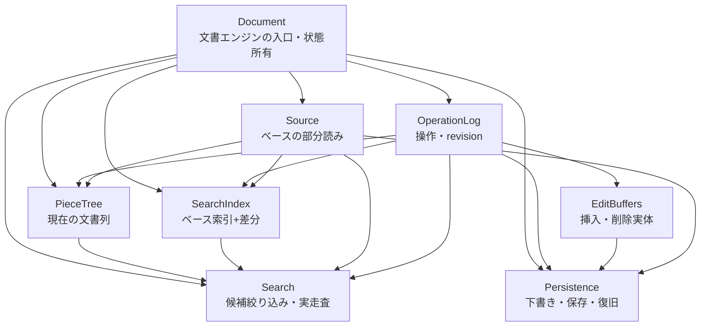
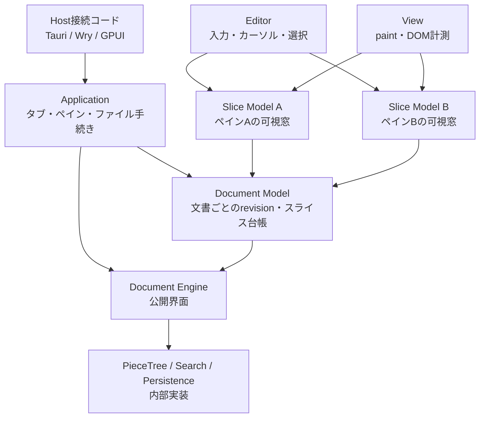

# 文書エンジンのモジュール境界

この文書は、Phase 3 で整える文書エンジンの責務と、Phase 4 以降の利用方向を定める。具体的なデータ構造、ファイル名、キャッシュ方式は実装時に決める。

## 基本原則

- 文書エンジンは GUI、WebView、AST、カーソル、ペインを知らない
- 文書の現在状態は、ベースと操作ログから導出される
- ピースツリーと検索インデックス差分は、操作ログから導出される状態であり、別の真実にしない
- 外部利用者は、ピースツリーや検索インデックスの内部構造へ直接触れない
- 文書エンジンの公開界面は、revision 付きの読み取り、編集、検索、保存、Undo/Redo とする

## モジュールの責務

### Document

文書エンジンの入口であり、1 文書の状態を所有する。

- ベース、操作ログ、ピースツリー、索引状態、保存状態をまとめる
- revision と保存済み revision を管理する
- Document Model が順序を決めたトランザクションを、基準 revision の検証・写像後に原子的に適用する
- 読み取り・編集・検索・保存の要求を各モジュールへ渡す
- 内部モジュールの状態を外部へ直接公開しない

### Source

ベースとなるファイルまたは保存済みデータを読む。

- seek による部分読みを提供する
- 文書のエンコーディングと改行規則を保持する
- ファイル全体をメモリへ読み込む API を提供しない
- 不正なバイト列を保持できる読み取りを提供する

### OperationLog

編集操作と revision の唯一の履歴を持つ。

- 各トランザクションは生成時点の `base_revision` を持つ
- 単一編集、複数編集、一括編集を同じ操作ログで表現する
- 各編集位置は `base_revision` 時点の文書バイト座標で表す
- 規則的な大量マルチカーソル編集は、編集位置を無制限に個別展開せず圧縮した一括操作として保持できる
- 挿入・削除の実体への参照を操作と一緒に保持する
- `head` より前を現在状態として扱う
- Undo/Redo は適用範囲を変更する
- 新しい編集が入った場合、`head` より後ろの Redo 枝を破棄する
- 古い revision を基準にした操作を現在座標へ写像する

### PieceTree

ベースと操作ログから得られる現在の文書列を、部分読み可能なピースの木として管理する。

- 元ファイルまたは操作ログが所有する編集実体のバイト範囲をピースで参照する
- B ツリーでピースの順序と部分木のバイト長・改行数を管理する
- 絶対行番号をピースへ持たせず、改行数累計から対象行を探索する
- 編集時は変更された経路だけを更新する
- ブロックと走査単位の所属情報を保持するが、検索件数の真実は持たない

### EditBuffers

操作ログが所有する挿入・削除の実体領域を提供する。

- 挿入実体と削除実体は別の追記領域に置いてよい
- 元ファイル由来の削除は可能な限り元ファイルの範囲参照として保持する
- 操作は実体全体を所有せず、範囲参照を持つ
- メモリ予算を超えた実体は操作ログの永続領域へ移す
- 操作ログとは独立した履歴を持たない
- 削除実体は Undo に必要な期間だけ保持する

### SearchIndex

固定ベース索引と、操作ログから導出した再構築可能な差分キャッシュを管理する。

- ベース索引はベースデータに対して作り、編集中は直接書き換えない
- 差分キャッシュは独立した編集ログを持たず、操作ログの適用範囲から再構築できる
- 索引は論理インデックスブロック単位で保持する
- 編集後の実走査単位は、論理インデックスブロックの子単位として扱う
- 件数推定はベース件数と操作ログ由来の差分を合算する
- 索引は候補絞り込みと概数推定に使い、ヒット位置の確定は実走査で行う
- 編集境界の前後 1 文字を含めて bi-gram 差分を計算する

### Search

検索要求をスナップショットへ固定し、候補絞り込みと実走査を行う。

- 検索開始時の revision を保持する
- 索引候補を使える場合は候補ブロックだけを走査する
- 走査中の編集結果は、操作ログで現在 revision へ写像する
- 編集範囲に重なる古い結果は無効化する
- キャンセルと逐次結果を公開界面に含める

### Persistence

下書き、索引、保存ジャーナルを永続化する。

- 下書きはベース参照と操作ログを中心に保持する
- 大きな保存では、最初の編集位置以降の元データを退避する
- 保存途中の状態を保存ジャーナルへ記録する
- 保存成功後にだけ新しいベースへの切り替えとログ破棄を確定する
- クラッシュ時はジャーナル、退避データ、操作ログから復元する
- 小さいファイルでは保存後 Undo のためのベーススナップショットを保持できる
- 巨大ファイルでは保存後 Undo のためのスナップショットを作らない
- 巨大ファイルの保存中は Application がモーダルな進行表示を出し、対象文書を変更する操作を停止する

## 文書エンジン内部の関係



## Phase 4 以降からの利用

Phase 4 以降の UI 側は、文書エンジン内部を直接参照せず、文書単位の公開界面だけを使う。

### Document Model

同じ文書を表示する複数スライスの窓口となる。

- 文書エンジンの handle と既知の revision を保持する
- 読み取り要求に revision と行範囲を付ける
- 編集操作を基準 revision 付きの行範囲置換として渡す
- 複数スライスの編集順を決め、1トランザクションへまとめる
- 文書エンジンからの変更通知を各スライスへ配る
- ピースツリー、索引、保存ジャーナルを直接操作しない

### Slice Model

各ペインの可視範囲を保持する。

- 文書エンジンから revision 付きの行範囲を取り寄せる
- 自分の窓と編集状態だけを保持する
- 文書全体、操作ログ、検索インデックスを保持しない
- 古い読み取り結果は revision 検証で破棄する

### View / Editor

View は描画し、Editor は入力を Slice Model へ渡す。

- View は文書エンジンや検索インデックスを知らない
- Editor は行・列の位置と revision を Slice Model へ渡す
- Document Model は変更された構造を行へ直列化し、行範囲置換として文書エンジンへ渡す
- 内部バイト座標への変換は文書エンジンの Document 境界で行う
- 構造の AST と文書エンジンのピースツリーを混同しない
- 検索結果は文書モデルから受け取り、現在のスライスへ表示する

### Application / Host

Application はファイル手続きとペインを組み立て、Host は GUI の変換だけを行う。

- Application は文書エンジンの公開界面を呼ぶ
- 巨大ファイルの保存中は Application がモーダルな進行表示を所有し、対象文書への変更操作を停止する
- Host は Application の要求を GUI フレームワークへ変換する
- Host は文書エンジンの内部モジュールを知らない
- 保存ダイアログなどの GUI 操作と、文書エンジンの保存処理を分離する

## Phase 4 以降の利用関係図



利用方向は次の通りとする。

```text
Host
  → Application
    → Document Model
      → Document Engine 公開界面
        → PieceTree / SearchIndex / OperationLog / Persistence

View
  → Slice Model
    → Document Model
```

逆方向の通知は、文書エンジンから revision 付きで Document Model へ返し、Document Model が該当する Slice Model へ配る。View が直接文書エンジンを呼んだり、文書エンジンが Slice Model や View を知ったりしてはならない。
