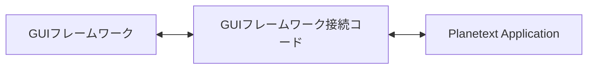

# リファクタリング計画

この文書は、設計点検でAsIsとのギャップが確認され、リファクタリング対象として
合意された項目だけを記録する。ToBeの規範は`docs/architecture.md`に記載する。

## 現在確定している対象

### GUIフレームワークとアプリケーションの分離

ToBe:

- GUIフレームワークはTauri、raw Wry、GPUI等から選択できる。
- 接続コードだけがGUIフレームワークとアプリケーションの両方を知る。
- 接続コードは可能な限り小さく保つ。
- WebViewへの依存はアプリケーション内にあってよい。
- 将来独自表示コンポーネントを追加してもWebView版との互換性を維持する。

## AsIsとのギャップ

### `src-tauri/src/lib.rs`

一つのファイルに次の二種類が混在している。

GUIフレームワーク接続として残すもの:

- Tauri Builderとplugin登録
- Window eventの受信とwindow操作
- native menu
- tray
- file / save / confirm dialog
- global shortcut
- single-instance
- `#[tauri::command]`の引数・戻り値変換

アプリケーション側へ分離するもの:

- Document registry
- Document IDの発行
- 文書を開く・閉じる処理
- 行読み込み、末尾読み込み
- 編集、Undo / Redo
- 保存処理
- encoding / line endingの管理
- 行数走査
- 検索jobとcancel
- copy範囲の組み立て
- dirty判定
- draftの内容と保存判断
- settingsの内容と適用判断

### `src-tauri/src/store.rs`

Tauri APIへ直接依存していないが、Tauri用crateの内部に置かれている。
GUIフレームワーク非依存のネイティブアプリケーションとして分離する対象とする。
中のアルゴリズムを変更することは、この分離作業の目的ではない。

### `src-tauri/src/menu.rs`

native menuを構築し、選択イベントをアプリケーションへ渡す処理なので、基本的に
GUIフレームワーク接続コードとして残す。
メニュー項目が実行する機能判断はアプリケーション側に置く。

### `src/ipc.rs`

現在は次が一つのモジュールに混在している。

- Tauriの`invoke` / `listen`
- native GUI呼び出し
- Document操作
- 検索
- draft
- settings

Tauriの`invoke` / `listen`とnative GUI呼び出しは、WebView側のGUIフレームワーク
接続コードとして分離する。
Document操作等はアプリケーションのAPIとして扱い、アプリケーションの各所に
Tauri command名や`window.__TAURI__`を見せない。

## GUIフレームワークAPIへ含めるもの

- ファイル選択ダイアログ
- 保存先ダイアログ
- 確認ダイアログ
- native menu
- tray
- global shortcut
- windowの表示・非表示・focus
- 外部URLを開く
- GUIフレームワークから届く共通イベント

## GUIフレームワークAPIへ含めないもの

- Document Store
- 文書のopen / close
- 行読み込み
- 編集、Undo / Redo
- 検索
- 保存処理
- encoding / line ending
- 下書き
- settingsファイルI/O
- clipboard
- 行数走査

ネイティブで動作するという理由だけではGUIフレームワークの責務にしない。

## 文書ストア(最下層ストレージ)

ToBe は `docs/architecture.md` の「文書ストア(ネイティブ側の最下層)」を参照。

### AsIs とのギャップ(`src-tauri/src/store.rs`)

- `Vec<Piece>` の線形走査 → ピースツリー(行数・バイト長を持つ平衡木)へ置き換える。
- `Piece::Fresh(Vec<String>)` が行の実体を直接持つ → 編集バッファ参照へ置き換える。
- `undo` / `redo` の `Step` スタック → revision 付き追記専用の操作ログから導出する形へ
  置き換える。
- `search_snapshot()` は開始時点の座標のまま結果を返し、走査中の編集で現在の文書と
  ずれる → 操作ログによる座標写像で現在座標へ変換し、編集範囲に掛かったヒットは
  無効化する。
- 検索索引は存在しない(毎回全走査) → 10MB 超で (バイグラム, 512KB ブロック,
  カウント) の索引を必要に応じて育て、永続化する。編集は操作ログから ± カウントの
  差分エントリを積み、ベース索引は書き換えない。
- 下書き(`save_draft`)が本文全体を書き出している → 「元ファイル参照 + 操作ログ」
  形式へ置き換える。復元はログ再生で行う。
- seek 基盤と tail 読み(`read_tail`)は維持する。mmap は読み出し器の内部最適化に
  とどめ、前提にしない。
- `Piece::Fresh(Vec<String>)` と履歴の `removed: Vec<String>` が編集・置換・Undo の
  実体をすべてメモリに持つ → メモリ予算を超える分は世代ファイル(テンポラリ)へ
  流し書きし、ピースと履歴はそこへの参照で表す。「すべて置換」を流し書きで
  実行できるようにする。

### 文書ストアで実装前に確定が必要な事項

- 索引キャッシュの置き場所とファイル形式、無効判定(サイズ・更新時刻・ハッシュ)と掃除
- バイグラムの正規化(大文字小文字、エンコーディングをまたぐ扱い)
- 操作ログの保持期間(undo 上限と生きているスナップショットの revision の関係)
- 正規表現からのリテラル抽出方式
- ピースツリーのノード構造と編集バッファの持ち方
- 編集・Undo をメモリに置く上限(メモリ予算)と世代ファイルの形式・掃除
- 改行をほとんど含まない巨大ファイル(1 行が数 GB)の行単位処理の扱い

## MVC(ファイルモデルとスライスモデル)

ToBe は `docs/architecture.md` の「MVC(1つのファイルモデルと複数のビュー)」を参照。

### AsIs とのギャップ

- WebView 側の行キャッシュ(`Document`)が doc_id ごとに 1 つでペイン間共有に
  なっている → ビューごとのスライスモデルへ分け、共有キャッシュをやめる
  (離れた場所を見るペイン同士がキャッシュ追い出しで干渉しない)。
- ファイルモデルからの変更通知がなく、`Session::changed` が `redraw_doc(doc_id, ...)`
  を直接呼んで全ビューの再描画を指揮している → 「行範囲置き換え + revision」の
  通知を受けた各スライスが自分の窓の分だけ更新する形へ置き換える。
- `Session` 内でモデル状態と表示・描画処理が密着し、グローバルの `DOCUMENTS` /
  `PANES` / `FOCUSED` マップが所有関係を不明瞭にしている → ファイルモデル、
  スライスモデル(写し + 編集操作・カーソル)、View(paint のみ)の所有関係を
  明示する構造へ整理する。
- View に残る編集判断・編集状態はスライスモデルへ移し、View は「どのスライスを
  見ているか」と AST の paint、入力の転送だけにする。
- Alt+クリックの連動編集(`commands.rs` の編集配布)は「同じ入力を複数スライスへ
  配る」連動グループとして整理し、同一文書のスライス更新と混ぜない。
- 連動編集の Undo: 1 回の入力に発行するグループ ID で各文書の履歴を 1 ステップに
  束ね、連動中の Undo/Redo は他の入力と同様に全メンバーへ配る形へ合わせる。
- 連動グループ関連で実装前に確定が必要な事項: 割り込み編集があったときの
  グループ連結の打ち切り判定。

## 全体点検で確認したその他の対象

### `src/app/sync.rs` の同期キュー

現在はタブごとのキューで native と同期している。合意した設計では
「操作ログ + revision 通知」がこの役割を吸収するため、sync.rs のキュー方式は
その実装に合わせて置き換える。

### `src/app/shell.rs` の責務混在

タブ・ペイン管理、ファイル手続き、IPC 呼び出し、画面組み立てが 1 ファイル
(1,000 行超)に同居している。MVC の所有関係整理(ファイルモデル・スライス・View)
の実装に必要な範囲で分割する。Shell の全面再設計は対象にしない。

### フロントエンドのグローバル状態

`thread_local!` のグローバル台帳が 12 箇所に散在している(`session.rs` に 5、
`sync` / `menu` / `drafts` / `clipboard` / `settings` / `syntax` / `shell` に各 1)。
`DOCUMENTS` / `PANES` / `FOCUSED` と同じ趣旨で、MVC の所有関係整理に合わせて
所有者(ファイルモデル・スライス・アプリケーション)へ移す。

### `editor/model/cursor.rs` の Intl.Segmenter 直接呼び出し

モデル層が単語分割のためにブラウザー API(JS)を直接呼んでいる。将来の
GPUI 独自表示でも単語選択が動くよう、単語分割を小さな界面の背後へ置く。
`input.rs` / `mouse.rs` の DOM イベント受け口は WebView presentation として
妥当なので対象にしない。

## 入力規則の統一(最上位と構造内部)

ToBe は `docs/architecture.md` の「入力規則は深さで変えない」を参照。

### AsIs とのギャップ

- 入力経路が 2 つに割れている: 最上位は `editor/trigger.rs`(スペース待ち方式)、
  構造内部は `structure/edit.rs` の `insert_char`(即時変換)。`trigger.rs` は
  `is_nested` だと早期 return する。
- `insert_char` の即時変換分岐(`/` → Stack、`^` → sup、`_` → sub、`(` `[` →
  group、矢印 → Stack)を廃止し、どの深さでも通常文字として挿入する。
- トリガー判定(文字列 + トリガー文字 + スペース)を「現在のカーソルがいる Row」
  へ一般化し、入力経路を一本にする。
- 即時変換を支えるためだけの状態(`waiting`、`carries_on` / `builds_on`、
  `transient_structure`)を、この一本化に合わせて削除する。

## 移行順序

各ステップは 1 コミット単位で行い、テストと GUI での挙動確認を付ける。
各 Phase の完了時に、下のチェック項目で `docs/architecture.md` からの逸脱が
ないことを確認する。

### Phase 1: フレームワーク分離(挙動不変)

1. WebView 側: `src/ipc.rs` を「Tauri 接続コード(invoke / listen のみ)」と
   「アプリケーション API」に分離し、`app` 各所から command 名と
   `window.__TAURI__` を隠す。
2. ネイティブ側: `store.rs` 等を Tauri 非依存の module/crate へ移し、`lib.rs` の
   アプリケーションロジックを分離。`#[tauri::command]` は変換だけの薄い層にする。
3. `GuiFramework` API + `GuiEvent` を導入し、dialog・menu・tray・shortcut・
   window 操作を接続コード経由にする。`menu.rs` は接続コードとして整理する。

チェック項目:

- [ ] アプリケーションコードに Tauri の型・command 名・`window.__TAURI__` が
      残っていない(接続コードだけが知る)
- [ ] 接続コードにエディタ機能・文書状態・保存判断が入っていない(変換と
      dispatch のみ)
- [ ] `GuiFramework` にネイティブ UI とウィンドウ管理以外の機能を足していない
- [ ] 挙動が一切変わっていない(機能追加・修正を混ぜていない)

### Phase 2: 文書ストア(単一の真実 = 操作ログ)

4. 操作ログ(revision)を導入し、`Step` スタックをログ導出へ置き換える。
   `search_snapshot` の結果を写像する。
5. ピースツリー化 + 編集バッファ参照(`Fresh(Vec<String>)` 廃止)。
6. 世代ファイル(メモリ予算超過の退避)+ 置換の流し書き。
7. 下書きを「元ファイル参照 + 操作ログ」形式へ。
8. bigram 差分インデックス(必要に応じて育てる + 永続化)。

チェック項目:

- [ ] ファイル実体をメモリへ乗せる操作・全文を返す API を追加していない
- [ ] seek 基盤と tail 読みが維持されている(mmap を前提にしていない)
- [ ] Undo・下書き・インデックス差分がすべて操作ログから導出されている
      (ログと別の真実を作っていない)
- [ ] ベース索引は不変な元ファイルだけを対象とし、編集で書き換えていない
- [ ] ビュー/スライス向けの界面がファイルサイズで分岐していない

### Phase 3: MVC(操作ログの消費者)

9. スライスモデル導入(共有キャッシュ廃止)、revision 通知で更新、`sync.rs` の
   キューを置き換える。
10. View の paint 専用化、グローバル状態の所有者移動、`shell.rs` の必要範囲
    分割、単語分割の界面化。
11. 連動グループ + 入力グループ ID の Undo。

チェック項目:

- [ ] ファイルの真実がファイルモデル 1 つにあり、スライスは捨てて取り寄せ直せる
- [ ] View が編集判断・編集状態を持たず、paint と入力転送だけになっている
- [ ] View・スライスが互いを知らない(再描画は revision 通知経由)
- [ ] 共有カーソルの実体を作っていない(連動は入力の複製)
- [ ] 連動中の 1 入力が 1 回の Undo で全て戻る
- [ ] モデル層からブラウザー API の直接呼び出しが消えている

### Phase 4: 入力規則統一(比較的独立、前倒し可)

12. トリガー判定を Row へ一般化して入力経路を一本化し、構造内の即時変換と
    待機状態を廃止する。

チェック項目:

- [ ] 最上位と構造内部で入力の規則に差がない(最上位の特権はタブ整列のみ)
- [ ] `/` `^` `_` `(` `[` 矢印がどの深さでも通常文字として入る
- [ ] 構造化は「文字列 + トリガー文字 + スペース」だけで起きる

### 全 Phase 共通のチェック項目

- [ ] `docs/architecture.md` に反する変更を入れていない(反する既存実装を
      見つけたら回避策を重ねず報告する)
- [ ] 1 コミット 1 意味単位を守っている
- [ ] 修正対象は実環境(GUI / WebView)で確認している

## 実装前に確定が必要な事項

- `GuiFramework` APIの正確なメソッドとデータ型
- GUIフレームワークからApplicationへ通知するイベント型
- Applicationの公開入口
- WebView側接続コードの配置
- ネイティブアプリケーションのcrateまたはmodule境界
- Tauri接続コードに残す初期化と終了処理
- raw Wry / GPUIで提供できない機能の扱い

これらが設計資料で確定するまで、実装コードの移動やリファクタリングは開始しない。

## 現時点で対象に含めないもの

次はまだ設計しておらず、この計画の対象に含めない。

- Session、Shell、Workspaceの再設計(MVCの所有関係整理に必要な範囲を除く)
- syntax highlightingアーキテクチャ
- 保存形式・構造モデルの変更
- crate全体の最終分割数
